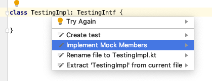
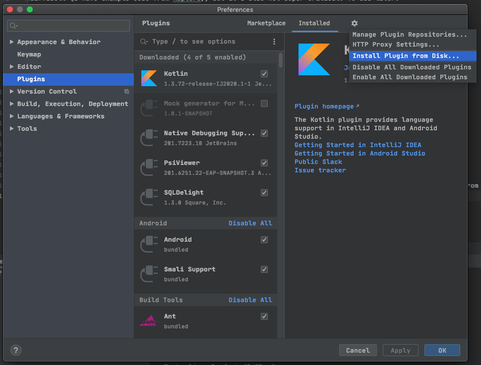

# Karmock Status

The code gen attempts to insert mock plumbing code into an implementation of an interface.

```kotlin
interface TestingIntf {
    val arst : String
    fun hey(): Long
}

class TestingImpl: TestingIntf {
    
}
```

The intellij plugin will add implementation inside `TestingImpl`

```kotlin
class TestingImpl: TestingIntf {
    internal val mock = InnerMock()
    override val arst: String by mock.arst
    override fun hey(): Long {
        return mock.hey.invoke({ hey() }, listOf())
    }

    inner class InnerMock(delegate: Any? = null) : MockManager(delegate) {
        internal val arst = MockPropertyRecorder<TT, String>({ arst }) {}
        internal val hey = MockFunctionRecorder<TT, Long>()
    }
}
```

The implementation includes an inner class called `InnerMock`, which extends `MockManager`. Each function and 
property of the interface gets a `Recorder` instance in `InnerMock`. There classes can be configured with activity 
to be triggered whene called, and can be verified after done with interaction.

```kotlin
@Test
fun arst(){
    val tt = TestingImpl()
    tt.mock.arst.returnOnCall("arst")
    tt.mock.hey.returns(22L)
    
    assertEquals(tt.hey(), 22L)
}
```

There are 2 recorders, `MockFunctionRecorder` and `MockPropertyRecorder`. I've added a set of interfaces for
each that are focused on config and verify operations. For example, for properties:

```kotlin
interface MockPropertyConfigure<RT> {
    fun throwOnCall(t: Throwable)
    fun returnOnCall(rt: RT)
}

interface MockPropertyVerify<RT> {
    val getCalled: Boolean
    fun setCalled(rt: RT): Boolean
    val calledCountGet: Int
    val calledCountSet: Int
}
```

These are separate because the next goal was to improve the config and verify steps, but that is incomplete. It
would look something like the following:

```kotlin
@Test
fun arst(){
    val tt = TestingImpl()
    tt.mock.config {
        arst.returnOnCall("arst")
        hey.returns(22L)
    }
    
    assertEquals(tt.hey(), 22L)
    
    tt.mock.verify {
        assertEquals(hey.calledCount, 1)
    }
}
```

Not implemented, but that's why there are multiple interfaces. Currently, the config and verify functions can feel 
a little confusing because they both show up on autocomplete, but you'll probably get used to it.

## Issues

Currently the plugin does not add the imports for the inserted plumbing code. This is technically not too 
difficult (I have example code from Kapture), but it's also not super critical. To add later.

## karmok-library

The library defines the mock plumbing. You'll need to publish locally to test.

## idea-plugin

This is the plugin. To test, go to 'Tasks > intellij > runIde'. You'll need to create 
a project, or import an existing one. You'll need to add the mavenLocal repo and add 
the library dependency to use the generated mocks.

To use the plugin, create a class that implements an interface. Option+Enter on the 
class name and you should see "Implement Mock Members". Select the members you want to 
include (which should be all, but still).



You can build the plugin with 'buildPlugin', which makes a zip in 'build/distributions'. You can import that from Intellij's 
settings pane.


